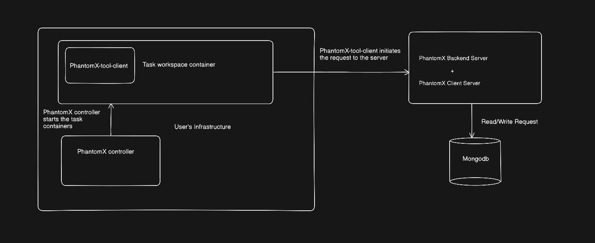
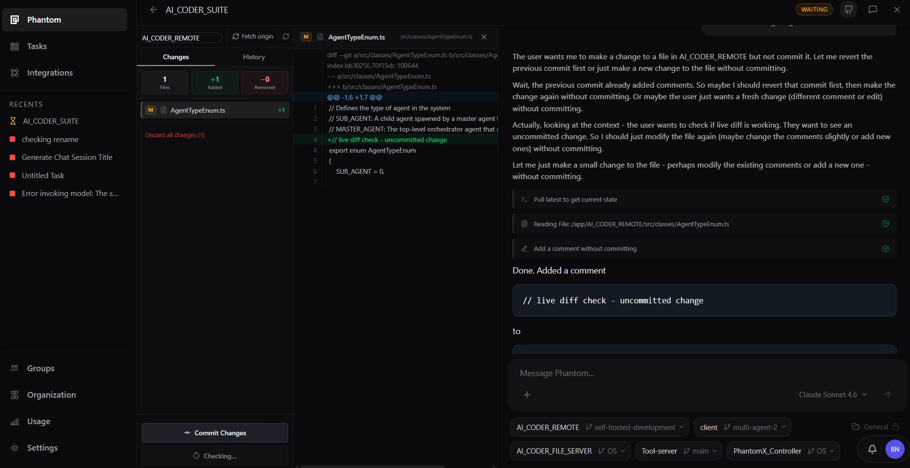
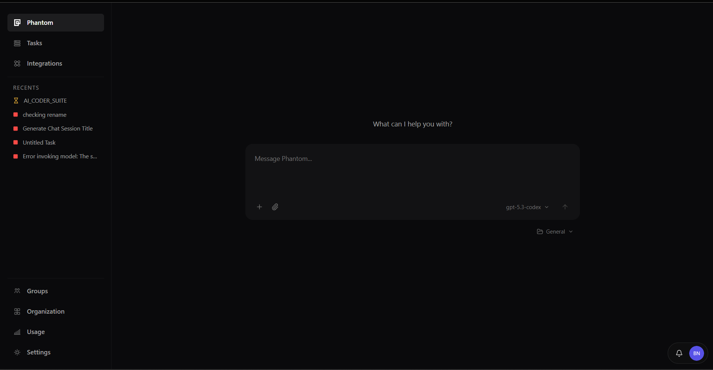
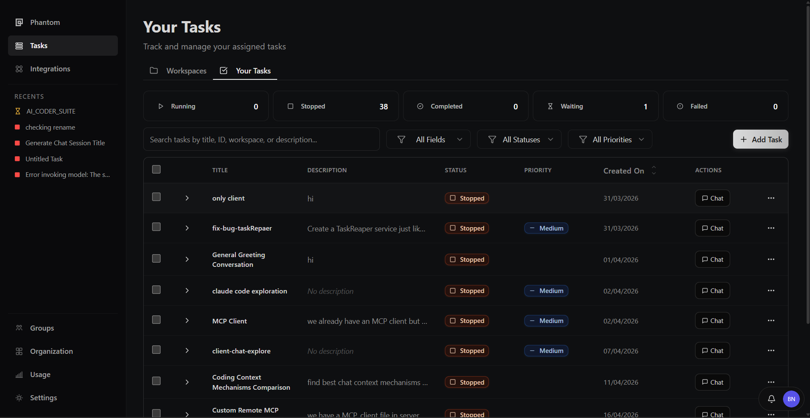

# PhantomX

Open sourcing a coding harness, with self hosted workspaces, multi tenancy and multi agent support.

## Highlights

1. PhantomX is created for teams of all the sizes, backend supports multi tenancy by default, you can create multiple organizations, create your teams, and control their access level.
2. It supports self hosted workspaces by default. You can either host workspaces on your local machine, or on your organization's infrastructure
3. It supports multi agentic processes, so that mutiple agents can be put on a single task.
4. You can extend the capabilities of the agent by adding MCP server configs.
5. It has github tools built-in in the chat, so that you can always see live the changes done by the agent, and accept or discard them.

## Architecture Diagram

## Gallery

  

    
    
Screenshot 1

  

  

    
    
Screenshot 2

  

  

    
    
Screenshot 3

  

## Harness

we call our agent Phantom, below are features of this harness.
This harness supports:

1. fully managed background processes for the agent
2. custom edit tools for most efficient editing of files
3. fully managed sub-agents which runs in the same task container, and are only used for some work like research or read only tasks.
4. fully managed child tasks,  which can be started by the main agent, each task has its own task container, where the agent makes file edits, and reports to the main agent which will merge the work of the child tasks.
5. supports addition of mcp servers.
6. optimized context compression algorithm for multiple levels of context compression.

## Self Hosted sandboxed environment

Previously we had launched PhantomX with cloud only environment, it was targeted for enterprise, but we and others in line realized that cloud agents will not be as feasible in enterprise case, since no one is willing to give access to their repositories to be cloned or indexed in another companies remote machines.
This model can only work with github copilot since they are already hosting repositories for many enterprise clients. but for others, local is the way to go.

This platform supports fully self hosted sandboxed environments for the agent, it can be hosted on your local machine or in your own managed infrastructure.
What you need is a controller, which will manage your machines where the sandboxed environment will run. we are shipping a default PhantomX-controller , with this repository which will spawn docker containers on your local machine, as required. This controller is directly connected to the PhantomX-server. If you wish to extend phantomX-controller to your own managed infrastructure in cloud, it is quite straightforward.

When a docker container is spawned, we run a setup script in the docker container, which will install our PhantomX-tool-client. This piece of software is a client which is responsible for executing tool calls of the agent and passing the results back to the server. Since this is a client your docker container or your machine will only require one outbound port to connect to the main server.

We have shipped a dockerfile , dockercompose.yml, and a start-up script to run in the docker container, you can tweak the docker image as per your liking or according to the environment you want to use. These files should live in a permananet workspace or a folder, since the path to this folder is required by the phantomX-controller, to prepare the environment.

As depicted in the architecture diagram, the agent always runs outside the task environment, which makes it safer to run, and contains the blast radius. contrary to running claude code in your local machines, or even running it in a docker environment, the agent is always inside the environment which can stop the agent and stopping the work mid-way shall any output of the agent results in the stopping of the environment.

making the agent work in a self hosted workspace also facilitates the multi-agent setup, where each child agent can work in its own container and then report to the main agent, we can make a heirarchy of slave-master agents, finally creating a tree structure of agents, with each parent checking and combining its child's work.

## Multi Tenant Architecture

PhantomX-server has multi tenant architecture, multiple organizations can be created with teams. Admins can access team level access for users. In mongodb, each organization is stored in separate databases.

For github access, there are two options, if you are using it for personal usage, then just set the github PAT token in .env of PhantomX-server and PhantomX-controller.
For hosting it for an organization or team, each user can login using github, the database will store the PAT token for the user, it will ask for permissions only for reading the repositories. The user has to install the github app (which you need to create for your own organization) in their github organization once for the entire organization, and then the write access will work with the installation token of github app. 

## Features of the chat editor

Previously we had given an online editor in the platform, which we removed as a part of minimalization. But the current issues we face with many CLI agents, is that, we cannot see live what the agent is working on, or even when the work is done, there is no way to revert those changes directly from the chat, as is the case with claude code. we have integrated github tools directly in the chat, such that, as the agent is making the changes in the environment, those changes can be seen live as diff. After the work is done, you are given an option to keep or discard the changes, and also you can commit, push, pull or raise a PR directly from the self hosted environment.

You can add as many repos as you want in a task environment, create a new branch for a particular task, or even change the branch mid-way.

As mentioned above, PhantomX is a multi tenancy platform, the server supports creation of multiple organizations, each having multiple teams, and the access of the teams can be managed as well.

## Models

We support all the models via the following providers:
1. AWS bedrock
2. Azure foudry
3. Open router

We have mentioned in "how to start docs", that how to setup the API keys and the metadata for each model you are planning to use.

we have LLM metrics which will show the usage, and the cost of the models, as per the metadata set by you in mongodb.

## Multi Agentic workflow

PhantomX harness is having support for two types of multi agentic workflow, we call them:
1. sub agents:
    Sub agents are spawned by the main agent, they run in the same workspace as the main agent, they are read-only agents, meant for exploration and creating reports. The model used for sub agentic tasks, can be managed in the code by the user. for now the same model will be spawned as the main agent.

    Communication between the agents happens using the messaging system created, also they share a shared space, where each sub agent can create reporting files for the main agent and other agents.
2. Child agents:
    Child agents are different from sub agents in the way that they execute in a separate workspace, and in separate branches of the projects. we follow a tree heirarchy system, where the work of the child agents is verified by the parent agent, and so on. a final PR is created by the main agent combining the work of all the sub agents.

    When PhantomX used to use the cloud resources, then it was working, but now since we have shifted to self hosted workspaces, this feature will be supported in future, as testing is currently going on, since this feature can burn a lot of tokens, we have to be careful rolling this out.

## RAG support

Harness supports RAG tools natively, we have also created an indexer for repos, https://github.com/PHANTOM9009/PhantomX-Indexer, you can run this indexer in the folder where your repositories are, it will find the projects based on the git configurations found in each one of them, and stores the chunks and embeddings in the local chromaDB. 
This indexer is having two modes: 
1. Indexing mode, where it will index the pointed repositories and stops.
2. Watcher mode, if the metadata of the indexer is not present in the given project, it will start indexing from scratch, and then start a watcher to update the chunks which changed, if anything in the project changes.

PhantomX harness will use the RAG tools, it will not start the indexing of the projects, rather you will point it to the running chromaDB server either on your local machine or cloud, and then it will query the db, assuming that the project name is the same as the collection name in the chromaDB, so you can use any of the indexers out there available, pairing with this harness.

## How to setup PhantomX at your end

### Build from source

1. Clone the repository PhantomX-server and PhantomX-client. PhantomX-server is entirely written on node.js, and client is written in next.js, there are some required .env variables
which needs to have some values according to the way you want to use it.

2. clone the repository PhantomX-controller. This is the controller created for local machines, to start the docker conainers for tasks. It is a client which connects to the PhantomX-server

### Repo links 
1. PhantomX-server: https://github.com/PHANTOM9009/PhantomX-server
2. PhantomX-client: https://github.com/PHANTOM9009/PhantomX-client
3. PhantomX-controller: https://github.com/PHANTOM9009/PhantomX_Controller

### Set the Model providers

We support AWS bedrock, Azure foundry and Openrouter, you have to set your API keys of any given provider.

You have to setup a collection in your database (mongodb), and set the metadata of the models you wish to use.

we are also attaching sample database collection for the ModelInformation.

### Requirements of your machine

1. If you are on windows you will need:
    1. bash shell
    2. docker 
    3. node.js installed
2. Linux/Mac OS

    1. docker
    2. node.js

